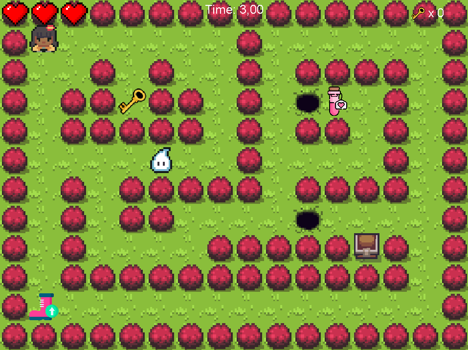

# MOSS Game  

`MOSS Game` is a labyrinth game developed in Java. The goal is to explore the maze, avoid dangers, and reach the treasure to win.  

  

## 🎮 Features  
- 🏆 **Winning Condition**: The player wins by reaching the treasure.  
- ⚠️ **Losing Condition**: The player loses if they fall into a hole.  
- ❤️ **Lives**: The hero has 3 lives.  
- 👾 **Monster**: A monster appears at the beginning of each game. If the player encounters it, they lose 1 life.  

### 🕹️ Controls  
- `Z` → Move forward  
- `Q` → Move left  
- `S` → Move backward  
- `D` → Move right  

## 🚀 Installation  

### Prerequisites  
You need to install [Maven](https://maven.apache.org/) to run the game.  

### Run the game  

```bash
mvn compile
mvn exec:java -Dexec.mainClass=start.Main
```

## Authors
This game started as a school project by [BEN RAIES Sabri](https://github.com/SabriBenRaies), [PHULPIN Suzy](https://github.com/suzyphulpin), [CARRETTE Orane](https://github.com/oranecarrette) and [FMARTINS Michelle](https://github.com/MichelleFMartins) 


